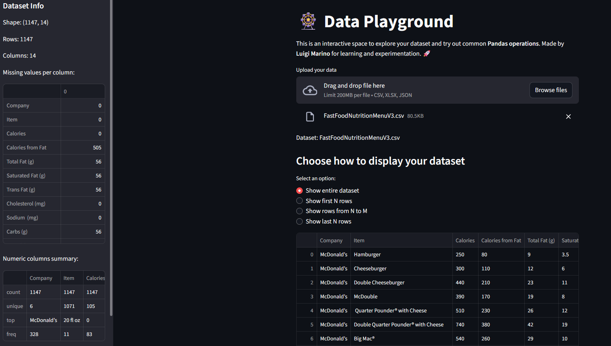

# 🎡 Data Playground

[](README.md)

## Table of Contents
- [Online dashboard](#online-dashboard)
- [Informazioni](#informazioni)
- [Dashboard](#dashboard)
- [Funzionalità](#funzionalità)
- [Dataset di default](#dataset-di-default)
- [Installazione](#installazione)
- [Utilizzo in locale](#utilizzo-in-locale)
- [Contribuire](#contribuire)
- [Autore](#autore)
- [Licenza](#licenza)

## Online dashboard
La dashboard è anche disponibile al seguente link:
**https://data-playground.streamlit.app/**

## Informazioni
**Strumento interattivo per l'esplorazione e la trasformazione dei dati costruito con Streamlit.**

Questa dashboard permette di caricare dataset, esplorarli in modo interattivo e applicare comuni operazioni della libreria Pandas per la pulizia e la trasformazione dei dati.  
⚠️ **Nota:** Questo progetto è in fase di sviluppo attivo — nuove funzionalità vengono aggiunte regolarmente.

---
## Dashboard 

---
## Funzionalità
> 🕓 Le funzionalità elencate di seguito si riferiscono all'ultimo commit
- Caricamento di dataset in formato **CSV**, **Excel**, o **JSON**.
- Anteprima del dataset:
  - Mostra l'intero dataset
  - Mostra le prime N righe
  - Mostra le ultime N righe
  - Mostra le righe da N a M
- Trasforma i tuoi dati in modo interattivo:
  - Rimuovi i valori nulli
  - Rimuovi le righe duplicate
  - Riempi i valori vuoti con diverse opzioni (valore fissato, media, mediana, moda)
- Riepilogo del dataset nella barra laterale:
  - Forma, righe, colonne
  - Valori mancanti per colonna
  - Riepilogo delle colonne numeriche
- Scarica il dataset nel formato che preferisci (`.CSV`, `JSON`, `XLSX`)


> Uno screenshot raffigurante due delle trasformazioni disponibili, accanto, per ognuna di esse, è possibile visionare il codice Python corrispondente.

---
## Dataset di default

All'interno della repository ci sono dei dataset di default sui quali è possibile effettuare delle prove, per aggiungere altri dataset nella lista di quelli di default basta inserire un nuovo file all'interno della cartella `sample_dataset/` e in automatico verrà visionato tra quelli disponibili.

---
## Installazione

1. Clona il repository:
```bash
git clone https://github.com/luigimarino01/Data-playground.git
cd Data-playground
```
2. Installa le dipendenze:
```bash
pip install -r requirements.txt
```

---

## Utilizzo in locale
Avvia l'applicazione Streamlit:
```bash
streamlit run app.py
```
- Apri l'URL fornito da Streamlit nel tuo browser.
- Carica il tuo dataset e inizia a esplorare e trasformare i tuoi dati in modo interattivo.

---

## Contribuire

Questo progetto è un esperimento personale di apprendimento ed è in fase di costruzione.  
Contributi e suggerimenti per nuove funzionalità sono benvenuti!

---

## Autore

**Luigi Marino** - [GitHub](https://github.com/luigimarino01)

---

## Licenza

Questo progetto è open-source e libero di essere utilizzato per scopi di apprendimento e sperimentazione.