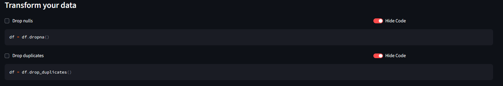

# 🎡 Data Playground

[](README-it.md)

## Table of Contents
- [Online dashboard](#online-dashboard)
- [About](#about)
- [Dashboard](#dashboard)
- [Features](#features)
- [Default dataset](#default-dataset)
- [Installation](#installation)
- [Local usage](#local-usage)
- [Contributing](#contributing)
- [Author](#author)
- [License](#license)


## Online dashboard
The dashboard is available at the following link:
**https://data-playground.streamlit.app/**

## About
**Interactive data exploration and transformation tool built with Streamlit.**

This project allows you to upload datasets, explore them interactively, and apply common Pandas operations for data cleaning and transformation.  
⚠️ **Note:** This project is under active development — new features are being added regularly.

---
## Dashboard 

---
## Features
> 🕓 The features listed below refer to the last commit 
- Upload datasets in **CSV**, **Excel**, or **JSON** format.
- Preview your dataset:
  - Show entire dataset
  - Show first N rows
  - Show last N rows
  - Show rows from N to M
- Transform your data interactively:
  - Drop null values
  - Drop duplicate rows
- Sidebar summary of dataset:
  - Shape, rows, columns
  - Missing values per column
  - Numeric columns summary
- Download transformed dataset in your preferred format (`.CSV`, `JSON`, `XLSX`)


> A screenshot showing two of the available transformations, next to which the corresponding Python code for each can be viewed.

---

## Default dataset
Inside the repository, there are default datasets on which you can run tests. To add more datasets to the list of defaults, simply place a new file inside the `sample_dataset/` folder, and it will automatically appear among the available ones.


---

## Installation

1. Clone the repository:
```bash
git clone https://github.com/luigimarino01/Data-playground.git
cd Data-playground
```
2. Install dependencies:
```bash
pip install -r requirements.txt
```

---

## Local usage
Run the Streamlit app:
```bash
streamlit run app.py
```
- Open the URL provided by Streamlit in your browser.  
- Upload your dataset and start exploring and transforming your data interactively.

---

## Contributing

This project is a personal learning experiment and under construction.  
Contributions and feature suggestions are welcome!

---

## Author

**Luigi Marino** -  [GitHub](https://github.com/luigimarino01)

---

## License

This project is open-source and free to use for learning and experimentation purposes.
